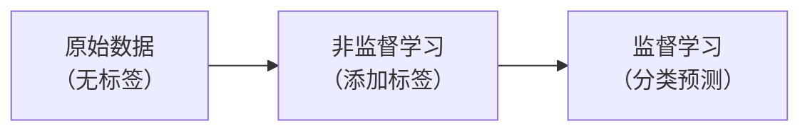

#机器学习 #人工智能 #ai #深度学习

# 机器学习

## 监督学习

- 分类问题是预测类别
- 回归问题预测的目标是实数

### 分类

### 回归

最小二乘法代数求解

$$f=sum^n_{i=1}{y_i-(\omiga_0+\omiga_1 x_i)}

## 无监督学习

### 聚类

```mermaid
graph LR
  A[原始数据\n（无标签）] --> B[非监督学习\n（添加标签）]
  B --> C[监督学习\n（分类预测）]
```

### 数据降维

### 图分析

### 关联规则
