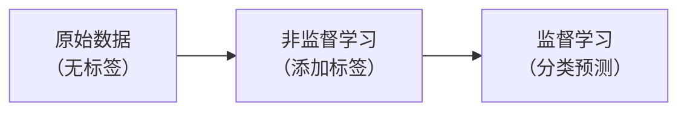

#机器学习 #人工智能 #ai #深度学习

# 机器学习

## 监督学习

- 分类问题是预测类别。
- 回归问题预测的目标是实数。

### 分类

- 监督学习的分类问题。

### 回归

最小二乘法代数求解

求平方损失函数$f = \sum^n_{i=1}(y_i-(\omega_0+\omega_1 x_i))^2$最小时，对应的$\omega$。

首先求$f$的一阶偏导：

$$\frac{\partial f}{\partial \omega_0}=-2(\sum^n_{i=1}y_i-n\omega_0-\omega_1\sum^n_{i=1}x_i^2)$$
$$\frac{\partial f}{\partial \omega_1}=-2(\sum^n_{i=1}x_iy_i-\omega_0\sum^n_{i=1}x_i-\omega_1\sum^n_{i=1}x_i^2)$$

## 无监督学习

### 聚类

将一堆数据按其特征相似度分为多个子类。

通过聚类的手段，给无标签数据添加标签。

聚类是无监督学习中的主要任务。

### 数据降维

### 图分析

### 关联规则

## 半监督学习

## 强化学习

