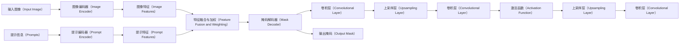
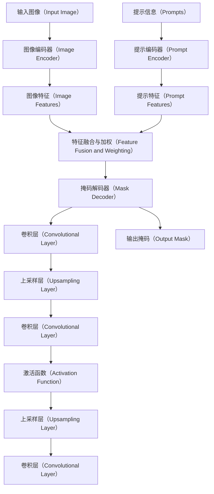

# 绪论

## 研究的背景及意义

医学影像技术，特别是计算机断层扫描（CT）技术，在现代医疗体系中扮演着至关重要的角色。CT图像能提供关于人体内部结构的详细视图，对于诊断、治疗计划制定以及病情监测等都极为重要。精确的图像分割技术能够帮助医生更好地理解和解析这些图像，从而在疾病诊断和治疗中做出更加精确的决策[@LiuLiangBinGuoNeiWaiTuXiangFenGeJiShuZaiYiLiaoJianKangLingYuYingYongFaZhanTaiShiFenXi2023]。医学影像技术如X射线、CT、MRI以及超声等允许医生非侵入性地查看体内器官的结构和功能。这些技术使得医生能够在疾病的早期阶段就进行诊断，特别是在肿瘤学、心血管疾病和神经系统疾病等领域。例如，通过MRI和CT扫描，可以早期发现和定位癌症肿瘤，大大提高治愈的可能性。精确的医学影像分析不仅有助于疾病的诊断，还能为制定个性化的治疗方案提供依据。例如，在放射治疗计划中，精确的图像分割可以帮助医生确定放射线剂量的精确分布，以最大限度地破坏肿瘤细胞同时保护周围健康组织。定期的医学影像检查可以监控疾病的进展情况，评估治疗效果，及时调整治疗策略[@LiXiaoYanJiaQiangGanAiNeiKeDuiWuJianSheChongShiGanAiNeiKeGuiFanHuaHeGeXingHuaZhenLiaoJueCe]。在手术前进行详细的影像分析可以帮助外科医生规划手术路径，识别并避开关键结构如血管和神经。此外，实时影像引导手术（如超声引导的介入手术）可以提高手术的精确性和安全性，减少手术中的风险。同时，随着精准医疗和个体化治疗策略的发展，医学影像分析在个体化医疗中的作用日益突出。通过分析患者的影像数据，医生可以更好地理解患者的独特生理和病理状态，从而提供更加定制化的治疗方案。医学影像分析还是许多生物医学研究的基础，例如在神经科学、肿瘤学和发育生物学等领域。高质量的影像数据和先进的影像处理技术能够帮助科研人员探索疾病的机制，发现新的治疗目标，以及评估新药物和疗法的效果。

肝脏肿瘤，包括良性和恶性肿瘤，是世界范围内常见的肝脏疾病之一。准确快速地对肝脏肿瘤进行分割，在临床诊断、治疗规划以及手术导航中起着重要作用。肝脏肿瘤的早期诊断和治疗是提高患者生存率的关键[@XingXueXiaSuiShengGanZangEXingZhongLiuWaiKeZhiLiaoDeXianDaiCeLue]。在诊断过程中，肝脏肿瘤的准确分割为医生提供了重要的形态学信息，有助于治疗规划和效果评估。随着医学影像技术，尤其是CT图像的快速发展，获得高质量的肝脏图像变得更加容易，但手动分割仍旧耗时且易受操作者经验的影响。因此，自动化的肝脏肿瘤分割技术在医疗领域的应用至关重要。

肝脏肿瘤分割是一项挑战性工作，因为肝脏肿瘤在早期往往体积较小难以分辨，并且肝脏的形态多变且肿瘤与正常组织的边界往往不清晰。在传统方法中，需要大量的手动标注工作，耗时且费力。而使用 SAM 处理具有明显边界和少量模糊的医学图像时，能够有效提高分割的准确性和效率[@mazurowskiSegmentAnythingModel2023a]。通过利用 SAM 模型的强大功能，开发针对性的肝脏肿瘤分割软件成为可能。

近年来，深度学习在图像处理和计算机视觉领域取得了显著进展，其在医学图像分割任务中展现出了巨大潜力[@JiangShengHuiJiYuShenDuXueXiDeGanZangJiGanZhongLiuCTTuXiangFenGeSuanFaYanJiu]。众多深度学习模型，如卷积神经网络（CNN）、U-Net、V-Net等已经被成功应用于肝脏肿瘤甚至多器官的分割，取得了优异的结果。这些研究不仅提高了分割的准确性，而且大大缩短了处理时间。Segment Anything Model（SAM），作为一种基于深度学习的全新模型架构，已在多个自然图像处理基准上显示出优异的性能。SAM 的引入为医学图像，特别是复杂的肝脏肿瘤分割任务，提供了新的可能性。

SAM 模型是 Meta AI 提出的一个基于 Transformer 的深度学习模型，它是在超过一亿张图像和相应标记的基础之上训练得来，用于执行零样本学习（Zero-shot Learning）中的图像分割任务，它能够通过接收简单的标注提示（如点、框等），自动产生精确的图像分割，这在处理医学图像中的不同器官和病变（如肝脏肿瘤）时，表现出独特的优势[@]。使用SAM 模型应用与医学图像处理具有以下优势：

- 泛化能力强：SAM通过在大量图像上进行预训练，学习了丰富的视觉特征表示，具备强大的泛化能力，能够应对多样的图像分割任务。
- 少样本学习：在具有少量标注数据的情况下，SAM仍然能表现出良好的分割效果，这对于医学影像分析尤其重要，因为高质量的医学标注数据往往难以获得。
- 自适应性强：作为一种自适应的模型，SAM能够根据不同的输入图像和分割任务调整其行为，这使得它在面对肝脏肿瘤这种形态多样、边界模糊的目标时，表现出比传统方法更好的分割精度。

在医学图像分析领域，特别是肝脏肿瘤的精确分割中，选择合适的图像分割算法对于提高诊断准确性和疾病管理至关重要[@PanLuHaiJiYuShenDuXueXiDeNaoBuZhongLiuYiXueTuXiangFenGeMoXingYanJiu2024]。基于SAM大模型的肝脏肿瘤分割软件开发具有重要的临床意义和广阔的应用前景。通过利用SAM模型的高泛化能力和出色的图像处理性能，可以极大地提升肝脏肿瘤的诊断精度，助力医生更有效地制定治疗计划，最终提高患者的生存率。开发此类高效的肝脏肿瘤分割软件不仅能推动医学影像分析技术的进步，也将为全球癌症治疗带来积极的影响。

## 国内外研究现状

### 研究进展与实例分析

在最近的研究中，有相关论文表明，SAM在处理带有阴影伪影和不均匀强度分布的超声图像时，能够有效识别并分割出肝脏肿瘤区域[@chenAbilitySegmentingAnything2023a]。此外，Mazurowski 等的 SAM 医学图像分割分析实验研究进一步验证了 SAM 在不同医学成像数据集上的广泛适用性，尤其是在处理肝CT图像时，SAM 显示出较高的 IoU 性能[@mazurowskiSegmentAnythingModel2023a]。

## 现有智能分割方法及其分类

作为新生的图像处理领域大模型，SAM 在医学图像处理领域还未得到广泛应用，目前主流医学图像分割方案多为使用深度学习技术的神经网络模型，以下是目前常用的分割方法。

### 传统的卷积神经网络（CNN）
CNN是深度学习技术中最早应用于医学图像分割的算法之一，它通过层叠的卷积层来提取图像特征，已成功应用于多种医学图像处理任务[@WangGuoLiYiXueTuXiangTuShenDuXueXiFenGeSuanFaZongShu2022]。然而，尽管CNN在特征提取方面表现出色，但其对训练数据的依赖性较大，需要大量精确标注的数据，这在医学领域往往是一个限制因素。此外，CNN模型的泛化能力受限于训练数据的多样性和质量[@JinHuYongJiYuJuanJiShenJingWangLuoDeShuiShengTongXinXiTongQianDaoJianCeYuXinDaoFenLei]。对数据的训练数据的大量需求增加了其训练开发难度，为该方面的实际应用增加了成本。

### U-Net 及其变种
U-Net 是为医学图像分割特别设计的网络结构，它通过特有的跳跃连接和上采样策略，有效地保留了图像的细节信息，适合于处理样本量较少的医学图像数据。U-Net 及其变种神经网络模型在肝脏肿瘤等复杂结构的分割任务中表现出良好的性能。然而，U-Net 对图像中的噪声和伪影比较敏感，这可能影响其在实际临床应用中的分割准确性[@ZhangChengChengJiYuJiLianJuanJiShenJingWangLuoDeGanZangZhongLiuFenGeYuJianCeFangFaYanJiu]。

### 基于 Transformer 的方法（如SAM）
近期，基于 Transformer 的 Segment Anything Model（SAM）展示了其在图像分割任务中的卓越潜力。不同于传统的 CNN 和 U-Net，SAM 采用 Transformer 架构处理图像中的长距离依赖，能够捕获更加丰富的上下文信息。SAM的 一个显著优势是其零样本学习能力，即在未见过的新图像上，仅通过少量的提示（如点或框）就能实现准确的分割。这一优势特性在处理多变的医学图像，尤其是肝脏肿瘤图像时显得尤为重要，因为这些图像常常包含不规则的肿瘤边界和复杂的背景结构。

### 集成方法
集成方法通过结合多种模型或算法，旨在提高分割任务的准确性和鲁棒性。在肝脏肿瘤分割中，集成不同类型的分割模型可以有效地提高预测的准确性，尤其是在处理图像质量不一或肿瘤形态多样的情况下。然而，集成方法的计算成本高，且实现复杂，这在资源有限的环境中可能是一个不利因素。

### 结论
总体来说，虽然多种方法各有优势，SAM 方法由于其强大的零样本学习能力和优异的上下文捕获能力，展现了在医学图像，特别是在肝脏肿瘤分割方面的独特优势。未来研究可以进一步探索如何优化 SAM 模型以适应具体的医学图像特征，以及如何将这些高级模型与医学专家的临床经验相结合，从而在提高肝脏肿瘤诊断和治疗的准确性方面发挥重要作用。

## 使用深度学习进行医学图像分割的性能指标

在使用深度学习进行医学图像分割时，评估模型性能的指标非常关键，它们帮助研究人员和临床医生理解模型的效果如何以及在可供改进的方向。常用性能指标如下：

##### 1. Dice Similarity Coefficient (DSC)

Dice系数，也称为F1分数，是评价分割质量的常用指标之一。它衡量两个样本的相似度，计算公式为：
 
$$\text{Dice} = \frac{2 \times |X \cap Y|}{|X| + |Y|}$$

其中 $X$ 和 $Y$ 分别代表预测结果和真实标注（ground truth）的像素集合。Dice 系数的值范围为0到1，1表示完美匹配。

##### 2. Jaccard Index (JI)

Jaccard指数，也称为交并比，是衡量预测分割和真实分割之间重叠程度的另一个指标，计算公式为：

$$\text{Jaccard} = \frac{|X \cap Y|}{|X \cup Y|}$$

与Dice类似，Jaccard指数的值也在0到1之间，值越高表示重叠度越大。

##### 3. Sensitivity (Recall)

敏感性或召回率衡量的是所有正样本中被正确识别为正样本的比例，公式为：

$$\text{Sensitivity} = \frac{TP}{TP + FN}$$

其中，$TP$ 是真阳性数量，$FN$ 是假阴性数量。高敏感性表明模型能够较好地识别出所有正样本。

##### 4. Specificity

特异性衡量的是所有负样本中被正确识别为负样本的比例，公式为：

$$\text{Specificity} = \frac{TN}{TN + FP}$$

其中，$TN$ 是真阴性数量，$FP$ 是假阳性数量。高特异性表示模型很好地避免了误报。

##### 5. Accuracy

准确率是所有分类正确的像素占总像素的比例，计算公式为：

$$\text{Accuracy} = \frac{TP + TN}{TP + TN + FP + FN}$$

这是一个直观的性能衡量标准，适用于像素级分类任务。

##### 6. Hausdorff Distance (HD)

Hausdorff距离衡量的是预测分割和真实分割边界之间的最大距离，是一种评价分割结果形状差异的指标。值越小，表示形状越接近。

##### 7. Average Surface Distance (ASD)

平均表面距离计算的是预测和真实分割表面之间点的平均欧氏距离。这个指标可以提供关于预测分割质量的更细致信息。

这些指标通常结合使用，可以全面评估模型在医学图像分割任务中的性能。在实际应用中，根据具体的医学需求和图像特性选择适当的评价指标尤为重要。

在本研究中，将主要使用 Dicd 与 IoU 指数评价模型对于肝脏肿瘤分割的结果优劣对比。

## 研究内容及创新点

第一章主要对介绍自动化肝脏肿瘤分割现有的可行方案和及未来发展方向进行了描述。综述了国内外近一段时间肝脏肿瘤等医学图像处理的研究及深度学习等大模型的发展应用，对比其性能指标。之后，讲述了深度学习图像处理的工作原理以及分类。讲解了评估模型的性能指标以及计算方法。

第二章简单介绍研究所用的各项技术原理，包括深度学习，pytorch 框架，SAM 模型。

第三章描述试验方法，首先安装模型与搭建微调必需的包，创建配置文件，然后使用数据集进行训练，最后遍历数据集训练，使用 Focal loss，Dice loss和IoU loss 输出损失函数。

第四章选取其他几种领先的分割模型作为比较对象，与本研究模型比较分析，全面评估基于 SAM 大模型的肝脏肿瘤开发软件的性能。

第五章对全文进行总结和展望。

本文的创新之处在于使用了大型自监督学习模型 SAM 开发肝脏肿瘤分割软件，该研究方法的优势体现在以下几个方面：

1. 提高肝脏肿瘤分割的准确性和灵活性：利用SAM模型的强大特征提取能力，可以更准确地识别和分割肝脏中的肿瘤组织，特别是在肿瘤边界模糊或与周围组织对比度低的情况下。

2. 减少对标注数据的依赖：由于SAM模型基于自监督学习，在训练过程中不完全依赖标注数据，通过利用自监督学习，该软件能够利用未标注的医学图像进一步提升模型的性能和泛化能力。

3. 提升分割速度，支持实时应用：针对 SAM 模型的实现进行了微调优化，使得肝脏肿瘤分割软件能够快速处理图像，满足临床环境中对实时或近实时分析的需求。

SAM 模型的提出者 Jim Fan 认为，这是计算机视觉领域的 GPT-3 时刻。GPT-3 是一种强大的自然语言处理模型，通过预训练和微调，能够适应各种语言任务。同样地，SAM模型通过预训练和微调，能够适应各种图像分割任务。这种跨领域的借鉴和启发使得SAM模型在视觉分割领域取得了重大突破。本文对 SAM 的研究开发是在探索和发展新的概念、工具和方法

### 结论
《基于SAM大模型的肝脏肿瘤分割软件开发》通过引入前沿的自监督学习技术，不仅提高了分割的精度和效率，还降低了对标注数据的依赖，提供了一种新的解决方案来解决医学图像分割中的一些长期挑战。这些创新之处使得该软件在医学图像处理领域具有较高的应用价值和推广前景。

## 本章小结

本章主要讲述的是基于 SAM 大模型的肝脏肿瘤分割的研究背景此外，本章简单描述了医学图像分割方法的发展历程以及时代需求，介绍了近几年国内外医学图像分割领域的研究现状，比较了目前医学图像处理的研究成果，介绍了几种重要的分割方法的工作原理以及分类，最后讲述了肝脏肿瘤分割软件开发的性能指标和研究内容。

# 技术原理学习

## 深度学习基本原理

深度学习是机器学习的一个分支，基于多层神经网络模拟人脑处理数据的方式[@GuoFengJiYuShenDuJuanJiShenJingWangLuoYaoGanTuXiangMuBiaoJianCeSuanFaYanJiu]。它涵盖从输入层接收数据，通过多个隐藏层处理，到输出层产生结果的过程。每个神经元根据权重和偏差处理输入，并通过激活函数引入非线性，使得模型能处理复杂任务。训练神经网络涉及使用损失函数评估预测误差，并通过反向传播和梯度下降等优化算法调整网络参数，以减少误差。此外，为避免过拟合，常用正则化技术如舍弃法（Dropout）[@WangRuiBoJiYuDropoutZhengZeHuaDeHanYuKuangJiaYuYiJiaoSeShiBie]。深度学习在图像识别、语音处理等领域展示出显著的应用潜力，通过适当的网络设计和算法优化，可以有效从大量数据中学习复杂的规律。深度学习模型能够从大量数据中自动学习到复杂的特征表示，这一点在图像识别、语音识别等任务中尤为显著。

## Pytorch框架

PyTorch 是一个开源的机器学习库，广泛用于计算机视觉和自然语言处理等领域。它由Facebook的人工智能研究团队开发，并得到了包括微软、Salesforce等多家大公司的支持和贡献。PyTorch 是一种强大的深度学习框架，适合从学术研究到商业应用的广泛用途。它的灵活性、用户友好的设计以及强大的社区支持使其成为当前最受欢迎的深度学习框架之一[@maSegmentAnythingMedical]。

- PyTorch 以其动态计算图（Dynamic Computation Graphs），即“define-by-run”方法论而闻名。这种方式让每一次的网络操作都可以动态地改变计算图，提供了极高的灵活性和直观操作方式，使得模型设计和调试更为简单直接。
- PyTorch 提供了丰富的API，这些API设计直观并易于理解，极大地简化了深度学习模型的开发过程。它支持大量的预定义层，如全连接层、卷积层、池化层等，以及多种损失函数和优化器，这使得构建复杂的神经网络变得更加容易。
- PyTorch 拥有一个活跃的社区，提供大量的教程、工具和预训练模型，这些资源可以帮助用户快速开始项目并解决遇到的问题。此外，PyTorch 与许多研究项目和商业应用相结合，形成了一个强大的生态系统。
- 由于其灵活性和简便性，PyTorch 在学术界特别受欢迎，成为许多最新研究论文的首选框架。它支持快速实验的特点，使研究人员能够验证新想法并迅速实现原型。
- PyTorch 不仅易于使用，而且在性能方面也非常优秀。它可以无缝地运行在CPU和GPU上，通过优化的C++库支持高效的内存使用和计算速度。
- PyTorch 提供了与其他重要科学计算库的接口，如NumPy和SciPy，以及可视化工具如TensorBoard。此外，它还支持ONNX（Open Neural Network Exchange）格式，这使得在不同框架之间转换模型变得更加容易。

本文研究将使用 PyTorch 框架微调 SMA 模型。在Python环境下，利用Pytorch库构建SAM大模型的基础框架。首先初始化模型结构，包括深度卷积网络、池化层、归一化层和全连接层，确保模型具备处理高维度数据的能力。紧接着，载入预训练的参数，以利用在其他大数据集上学到的特征。

## Transformer

Transformer是一种基于自注意力机制的神经网络架构，最初由Vaswani等人在2017年的论文《Attention Is All You Need》中提出。Transformer模型在自然语言处理（NLP）任务中取得了巨大成功，并被广泛应用于其他领域如计算机视觉（例如VIT, vision Transformer）。以下是对Transformer模型的详细介绍。

### Transformer模型的组成

Transformer模型主要由编码器（Encoder）和解码器（Decoder）两部分组成，每部分由多个相同的层（layers）堆叠而成。每个层主要包含两个子层（sublayers）：

#### 1. 编码器（Encoder）

每个编码器层包含以下两个子层：
- **自注意力层（Self-Attention Layer）**：计算输入序列中每个位置的注意力分数，捕捉输入序列中的全局依赖关系。
- **前馈神经网络（Feed-Forward Neural Network, FFN）**：对每个位置的输入进行独立的非线性变换。

每个编码器层的输出会通过残差连接（residual connection）和层归一化（layer normalization）后，传递给下一层。

#### 2. 解码器（Decoder）

每个解码器层包含三个子层：
- **自注意力层（Self-Attention Layer）**：与编码器相同，但只对解码器输入的前缀部分计算注意力分数。
- **编码器-解码器注意力层（Encoder-Decoder Attention Layer）**：将解码器的输入与编码器的输出结合，计算注意力分数，捕捉输入与输出之间的依赖关系。
- **前馈神经网络（Feed-Forward Neural Network, FFN）**：与编码器相同，对每个位置的输入进行独立的非线性变换。

同样，每个解码器层的输出也会通过残差连接和层归一化后，传递给下一层。

### 自注意力机制（Self-Attention Mechanism）

自注意力机制是Transformer的核心组件，它允许模型在计算每个位置的表示时，考虑整个序列中的其他位置。其工作原理如下：

1. **输入变换**：
    - 将输入序列（例如词嵌入）变换为查询（query）、键（key）和值（value）向量：
        $$
        Q = XW_Q, \quad K = XW_K, \quad V = XW_V
        $$
        其中，$W_Q$, $W_K$, $W_V$ 是学习到的权重矩阵。

2. **计算注意力分数**：
    - 计算查询与键的点积，并进行缩放和软最大化（softmax），得到注意力分数：
        $$
        \text{Attention}(Q, K, V) = \text{softmax}\left(\frac{QK^T}{\sqrt{d_k}}\right)V
        $$
        其中，$d_k$ 是键向量的维度。

3. **加权求和**：
    - 使用注意力分数对值向量进行加权求和，得到每个位置的新表示。

### 多头注意力机制（Multi-Head Attention）

为了捕捉不同子空间的信息，Transformer使用了多头注意力机制。具体做法是将查询、键、值向量分成多个头，每个头独立计算注意力，然后将结果拼接在一起，并通过线性变换得到最终的输出：
$$
\text{MultiHead}(Q, K, V) = \text{Concat}(\text{head}_1, \ldots, \text{head}_h)W_O
$$
其中，$\text{head}_i = \text{Attention}(QW_{Q_i}, KW_{K_i}, VW_{V_i})$。

### 位置编码（Positional Encoding）

由于Transformer没有卷积或递归结构，它无法直接捕捉输入序列的位置信息。为此，Transformer在输入中添加了位置编码，提供位置信息。位置编码可以是固定的，也可以是可学习的，其形式通常为：
$$
\text{PE}_{(pos, 2i)} = \sin\left(\frac{pos}{10000^{2i/d}}\right), \quad \text{PE}_{(pos, 2i+1)} = \cos\left(\frac{pos}{10000^{2i/d}}\right)
$$
其中，$pos$ 是位置，$i$ 是维度索引。

### 总结

Transformer通过自注意力机制和前馈神经网络，在自然语言处理和其他领域中实现了卓越的性能。其核心优势在于能够捕捉全局依赖关系，易于并行计算，并且具有良好的扩展性。自推出以来，Transformer模型已经衍生出许多变种和改进版本，并在许多任务中取得了显著成果。

## 分割大模型（SAM大模型）

本文主要研究通过对 SAM 大模型的微调训练，以适应在医学图像处理，尤其是对腹部 CT 扫描图像的肝脏肿瘤分割。

### 背景

SAM（Segment Anything Model）是近年来出现的一种新型深度学习模型，由 Meta 的 FAIR 实验室提出，旨在通过单一的模型实现对任何对象的高精度分割。SAM大模型通过大规模数据的预训练和针对特定任务的微调，实现了对不同对象类型的准确识别和分割。

SAM模型的强大之处在于它借鉴了自然语言处理领域的 Foundation Model。Foundation Model 在预训练阶段学习了大量的语言知识，从而能够在各种语言任务中表现出色。同样地，SAM模型在预训练阶段学习了大量的视觉知识，使其能够适应各种下游图像分割任务。

SAM模型的核心思想是使用提示学习来适应不同的分割问题。提示学习是一种通过给模型提供一些指导信息来帮助其完成任务的方法。在SAM模型中，研究者们设计了一种可提示的分割任务，使模型可以根据不同的任务需求进行微调。这种可提示的特性使得SAM模型能够轻松地适应各种复杂的分割问题，例如语义分割、实例分割等。

为了实现强大的零样本学习能力，SAM模型在预训练阶段使用了大规模的数据集进行训练。通过在大量图像数据上的学习，模型能够提取出通用的视觉特征，从而在面对新的、未见过的图像时，能够快速地进行有效地分割。这种零样本学习能力使得SAM模型在处理新场景、新任务时具有很大的优势，例如将其微调，用于肝脏肿瘤分割软件的开发[@LunWenJieDuMetaAiSAM]。

在网络数据集上预训练的大语言模型具有强大的 zero-shot(零样本)和 few-shot(少样本)的泛化能力，这些“基础模型”可以推广到超出训练过程中的任务和数据分布，这种能力通过“prompt engineering”实现，具体就是输入提示语得到有效的文本输出，使用网络上的大量文本资料库进行缩放和训练后，可以看出这种零样本和少样本的训练的模型比专一性质功能模型效果还要好。数据集越大，效果越明显。
视觉任务上也对这种基础模型进行了探索，比如CLIP和ALIGN利用对比学习，将文本和图像编码进行了对齐，通过提示语生成image encoder，就可以扩展到下游任务，比如生成图像[@kirillovSegmentAnything2023]。

SAM通常在自然图像上表现优异，但是在特定领域如医疗影响，遥感图像等，由于训练数据集缺乏这些数据，SAM的效果并不是理想。因此，在特定数据集上微调SAM是十分有必要的。

### SAM 模型结构

SAM模型结构主要包括以下几个部分：

1. 图像编码器（Image Encoder）：
- 接收输入图像并提取图像特征。
- 通常使用预训练的视觉模型，如VIT（vision Transformer）。

2. 提示编码器（Prompt Encoder）：
- 处理用户提供的提示信息（如点、框、文本等）。
- 提取提示信息的特征表示。

3. 掩码解码器（Mask Decoder）：
- 将图像特征和提示特征进行融合。
- 生成分割掩码。

4. 特征融合与加权（Feature Fusion and Weighting）：
- 通过逐元素相乘（element-wise multiplication）对图像特征进行加权。
- 利用提示特征对图像特征进行调整，提升分割精度。

5. 最终输出：
- 生成图像的分割掩码。

#### 详细步骤

- 输入图像（Image）：模型接收一幅输入图像。
- 图像编码器（Image Encoder）：输入图像经过图像编码器（通常是VIT），提取出高维度的图像特征。
- 提示编码器（Prompt Encoder）：用户提供的提示信息（如标记点、框等）经过提示编码器，提取出提示特征。
- 特征融合与加权（Feature Fusion and Weighting）：图像特征和提示特征进行融合。具体操作是通过逐元素相乘（element-wise multiplication），使提示特征对图像特征进行加权。
- 掩码解码器（Mask Decoder）：融合后的特征通过掩码解码器，生成图像的分割掩码。
- 最终输出（Final Output）：输出最终的分割掩码，表示图像中的分割区域。

#### 图像编码器（Image Encoder）

利用mae预训练的初始点（VIT），最低限度适应高分辨率的输入，该编码器在提示编码器（prompt encoder）之前，对每张图像只运行一次。

输入(c,h,w)的图像，对图像进行缩放，按照长边缩放成1024，短边不够就pad,得到(c,1024,1024)的图像，经过图像编码器（image encoder）处理，得到对图像16倍下采样的特征（feature），大小为(256,64,64)。

#### 提示编码器（Prompt Encoder）

提示编码器分成2类：稀疏的(点，box，文本)，稠密的（mask）

- 点（point）:映射到256维的向量，包含代表点位置的位置编码（positional encoding），加 2 个代表该点是前景/背景的可学习的嵌入（embedding）。
- 框（box）:用一个嵌入对表示（1）可学习的嵌入代表左上角（2）可学习的嵌入代表右下角
- 文本：通过CLIP模型进行文本编码。
- 掩码（mask）:用输入图像 $1/4$ 分辨率的掩码，然后用 (2,2) 卷积核步长为 2，输出通道数为4和16，再用 (1,1) 卷积核将通道数量升到256。掩码和图像嵌入（iamge embedding）通过逐元素相乘（element-wise），也就是说用掩码的特征对图像的特征进行加权使特定区域被放大或抑制。

## 本章小结

本章探讨了深度学习的基本原理、PyTorch 框架的特点，以及 Transformer 和 SAM（Segment Anything Model）模型的结构与机制。深度学习通过多层神经网络模拟人脑处理数据的方式，从输入层接收数据，经隐藏层处理后，在输出层产生结果。其关键在于使用损失函数评估预测误差，并通过反向传播和梯度下降等优化算法调整网络参数，以减少误差。PyTorch 是一个开源的机器学习库，以动态计算图和易用的 API 著称，广泛应用于计算机视觉和自然语言处理领域。Transformer 是一种基于自注意力机制的神经网络架构，通过编码器和解码器捕捉输入序列的全局依赖关系，易于并行计算且具有良好的扩展性。SAM 模型由 Meta 的 FAIR 实验室提出，旨在通过单一模型实现高精度分割。它通过大规模数据预训练和提示学习，适应各种下游图像分割任务。其结构包括图像编码器、提示编码器、特征融合与加权、掩码解码器和最终输出部分，通过对图像特征和提示特征的融合与加权，生成高精度分割掩码。这些技术和模型展示了深度学习在图像处理领域的强大性能和应用前景，为后续研究奠定了基础。

# 研究方法

## 准备数据集

数据集内容包括以下内容

| 文件名 | 文件内容 |
|---|---|
| PATIENT_DICOM | DICOM 格式的匿名患者图像 |
| LABELLED_DICOM | DICOM 格式分割的各个感兴趣区域对应的标签图像 |
| MASKS_DICOM | 包含每个 mask 的 DICOM 图像的各个感兴趣区域的名称对应的一组新子文件夹 |

对数据集分组，80% 作为训练集，20% 作为测试集。

## 加载预训练模型

## 冻层输入层，只微调顶部层

## 训练模型并监控性能，如损失值

### 使用数据集进行训练

最后遍历数据集进行训练，使用的损失函数有Focal loss，Dice loss和IoU loss

利用腹部CT图像构建的训练集对SAM大模型进行训练。在此过程中，采用交叉验证来优化超参数，使用批量梯度下降和反向传播算法进行权重地更新。通过细致地微调，提升模型对肝脏肿瘤图像特点的学习能力和分割准确性。

## 模型性能的评估 评估模型，在测试集观察模型表现。

在搭建好的SAM大模型上实施肝脏肿瘤的分割任务，使用常见性能指标，如像素准确度（Pixel Accuracy）、交并比（Intersection over Union，IoU）等评价模型性能。通过这些指标，可以量化分析模型的分割效果。

## 本章小结

探讨了使用SAM大模型进行肝脏肿瘤分割的整个训练和微调过程，以及软件开发的关键步骤。首先，我们通过安装和配置必要的环境和库，为SAM模型的部署和训练奠定了基础。接着，创建了详细的配置文件，指定了模型训练的关键参数，包括冻结的网络层、学习率、优化器配置和训练周期等。

通过实际数据集的训练，模型经历了从初始化到连续迭代过程，每个训练周期都细致地调整了模型的权重，以适应复杂的肝脏肿瘤图像特征。在训练过程中，我们使用了多种损失函数，包括 Focal loss、Dice loss和IoU loss，这些都是为了优化模型在分割任务上的表现并减少预测误差。

最终，模型的性能通过多个标准评估指标进行了量化，包括像素准确度、交并比等，这些指标帮助我们客观评价了模型在实际肝脏肿瘤分割任务中的效能。此外，通过结果的可视化分析，我们能够直观地看到模型在处理真实图像数据时的表现，包括成功案例和需要改进的地方。

# 结果分析与性能比较

为了全面评估基于SAM大模型的肝脏肿瘤分割软件的性能，本研究将选取其他几种领先的分割模型作为比较对象。包括但不限于经典的U-Net模型和V-Net模型，它们在医学图像分割领域内已有大量成功应用。通过实际的实验数据，本研究采用了以下性能评价指标：

- 精确度（Precision）
- 召回率（Recall）
- F1分数（F1 Score）
- 交并比（IoU）

性能对比分析侧重于考察SAM大模型与其他模型在精确度、召回率等方面的差异，同时评价模型的计算效率。分析结果指出SAM模型在精度上具有优势，尤其在小肿瘤区域的分割上显示出更高的敏感性。

# 结论与展望

## 结论

本研究通过开发基于SAM大模型的肝脏肿瘤分割软件，展示了深度学习在医学图像分割领域的强大潜力。SAM大模型的引入，提高了分割精确度，尤其在处理腹部CT图像中肝脏肿瘤的复杂情况时表现出显著的优势。通过与其他流行模型的性能对比，本研究不仅证明了SAM大模型在肝脏肿瘤分割任务上的有效性，也为未来在此类应用中深度学习模型的优化提供了有价值的参考。

进一步的分析和实验结果表明，虽然基于SAM大模型的分割软件在准确度上取得了优异的成绩，但仍存在计算效率和模型泛化能力方面的挑战。未来的工作可以着重于这些方面，探索更高效的算法或技术来提升模型性能，从而更好地服务于临床诊断和治疗规划。

尽管 SAM 在肝脏肿瘤分割上显示出前景，但仍需针对医学图像的特点进行进一步优化和调整。未来的研究可以探索如何结合医学专家的知识和SAM的自动学习能力，以提高分割精度，减少需要手动调整的工作。同时，开发面向特定如肝脏肿瘤的深度学习模型，将是推动医学图像处理技术发展的关键。

综上所述，基于 SAM 模型的肝脏肿瘤分割软件的开发，不仅可以改善现有的图像分割方法，还有助于提高肝脏疾病的诊断效率和准确性。未来的研究应当着重于模型的实际应用和临床转化，以实现医学影像自动化分析的最终目标。

## 展望

在基于 SAM 大模型的肝脏肿瘤分割软件开发上取得了很好的成效，将来可通过对模型的进一步优化微调与前端开发提升其性能与易用性。我希望在以后的学习中能在该研究方面继续不懈学习和研究，也希望能通过自己的努力能够为医疗领域图像处理奉献力量。

# 参考文献

# 致谢
在本科毕业论文的撰写过程中，得到了许多人的帮助和支持。在此，我衷心感谢他们每一个人。首先，我要特别感谢我的导师刘琨，在学术上给予我无限的指导。刘琨老师严谨的学术态度、深厚的专业知识和无私的精神深深影响了我。在论文的选题、研究以及写作过程中，刘琨老师都给予我悉心指导，每一次讨论都让我受益匪浅。感谢测控专业的所有老师和同学们，在我的大学生活中给予我帮助和支持。特别是实验室的同学们，我们共同度过了许多难忘的时光，彼此间的讨论和合作使我受益良多。此外，我还要感谢我的家人对我的支持和鼓励。父母始终是我最坚强的后盾，他们的理解和爱让我在遇到困难和挫折时永不放弃。感谢他们无条件的爱和对我的信任，是他们让我有勇气追求自己的梦想。最后，感谢所有曾经给予我帮助和启发的人。是你们的帮助和支持使我能够顺利完成我的学业。
