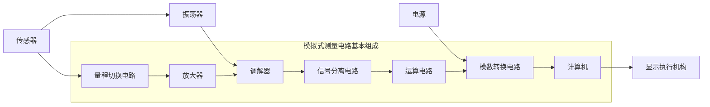
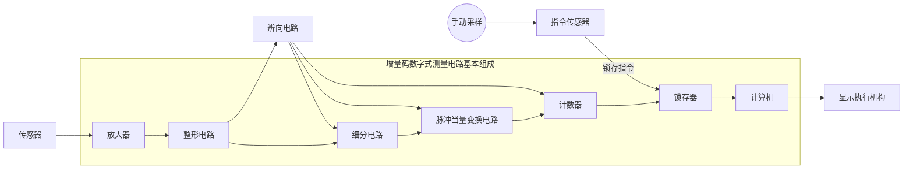
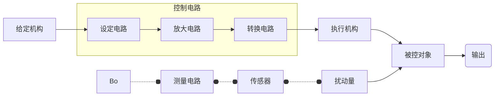
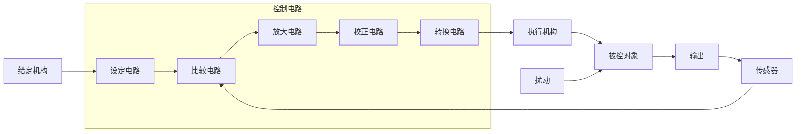

# 测控电路

## 测控电路的功用

- **放大电路**：将传感器输出的电信号进行高倍率放大，提高仪器的分辨能力，减小读数误差，满足后续仪器的要求。
- **调制解调**与**分离电路**：选取有用信号，抑制无用信号，从而减小干扰、噪声及非被测参数的影响。
- **运算与转换电路**：对信号进行各种运算与转换。

## 测控电路的特点

- 精度高：能准确无误地测量被测对象的状态与参数。
	- 低噪声、高抗干扰能力；
	- 低漂移、高稳定性；
	- 线性度和保真度好；
	- 合适的输入与输出阻抗。
- 动态性能好：响应快、动态失真小。
- 高识别和分辨能力：识别不同特征的信号与噪声。
- 转换灵活：能进行各种转换，如 A/D、V/I、V/F、量程转换。
- 可靠性高与经济性好：性能可靠、经济实用。

## 输入输出

### 模拟信号

- 非调制信号：信号大小、波形与被测量之间具有一一对应的线性关系。如：压电式传感器测量工件的表面粗糙度，磁电式传感器策鳄梨昂速度，热电偶测量温度。
- 已调制信号：信号经过调制，提高抗干扰能力，便于放大和远距离传输。如：电阻、电容、电感传感器接入交流电桥输出为调幅信号。
	1. 载波信号：运载被测低频信号的高频信号
	2. 载波频率：载波信号的频率（高频）
	3. 调制信号：对载波信号进行调制的信号（被测信号）
	4. 已调信号：经过调制后的信号（调幅、调频、调相）
	5. 调幅信号：载波信号幅值受到调制的信号

### 数字信号

- 增量码信号：信号大小由信号变化周期数的增量决定，与被测对象的增量无关。
- 绝对码信号
- 开关信号

## 类型与组成

### 测量电路

- 模拟式测量电路
- 数字式测量电路

控制电路的基本组成

- 开环控制
- 闭环控制

### 控制系统

开环控制系统的基本组成

闭环控制系统的基本组成

## 发展趋势

- 优质化
- 数字化
- 网络化
- 微型化与集成化
- 通用化与模块化
- 测控一体系通话
- 自动化与智能化

