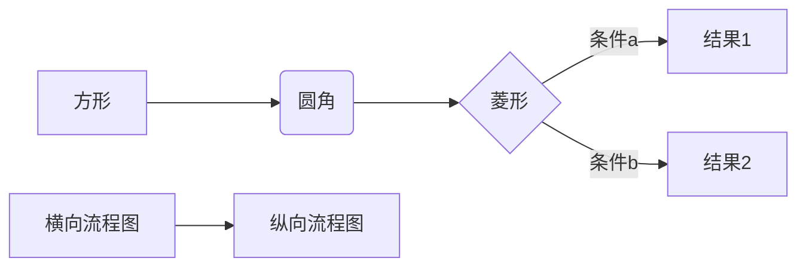
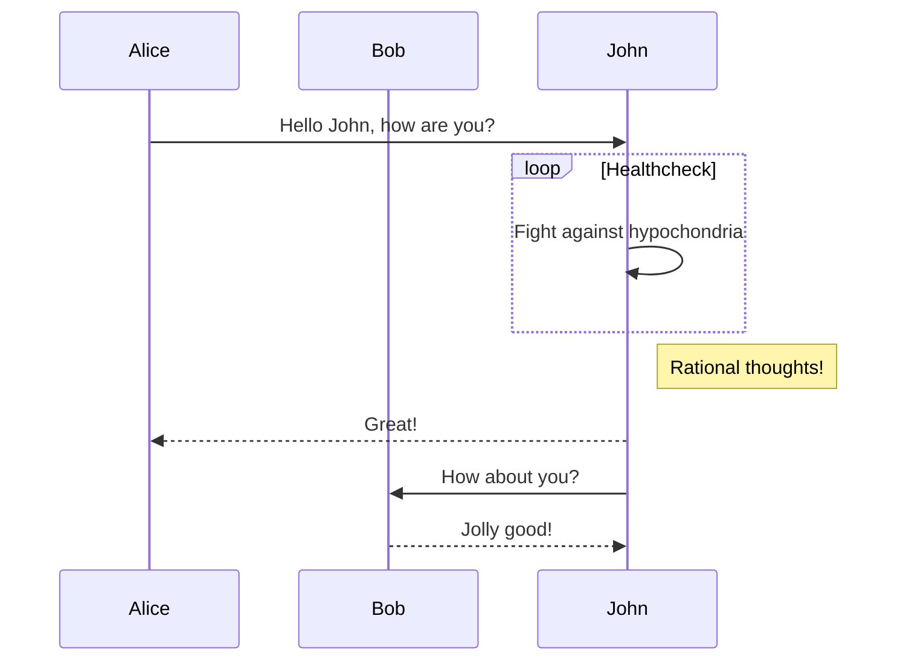
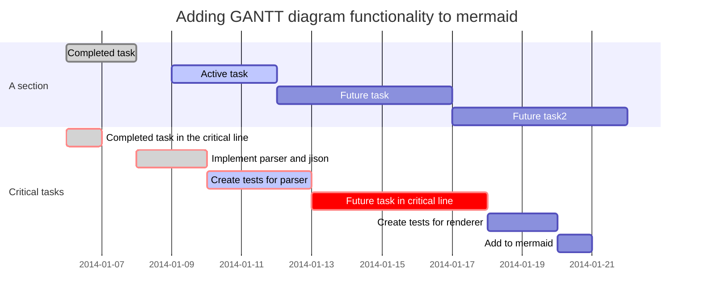
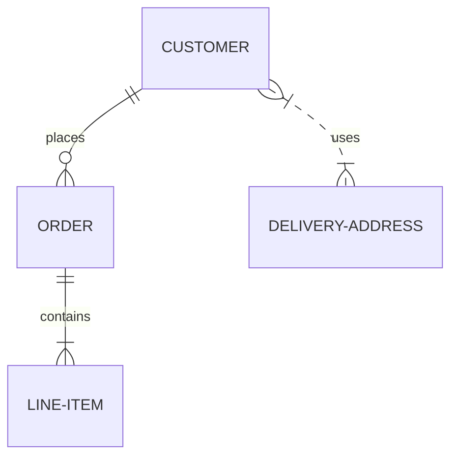

1. 流程图

示范

```txt

```mermaid
graph LR
    A[方形] -->B(圆角)
    B --> C{菱形}
    C -->|条件a| D[结果1]
    C -->|条件b| E[结果2]
    F[横向流程图]-->G[纵向流程图]
```


```mermaid
graph LR
    A[方形] -->B(圆角)
    B --> C{菱形}
    C -->|条件a| D[结果1]
    C -->|条件b| E[结果2]
    F[横向流程图]-->G[纵向流程图]
```

2. 时序图

```

```mermaid
sequenceDiagram
    participant Alice
    participant Bob
    Alice->>John: Hello John, how are you?
    loop Healthcheck
        John->>John: Fight against hypochondria
    end
    Note right of John: Rational thoughts!
    John-->>Alice: Great!
    John->>Bob: How about you?
    Bob-->>John: Jolly good!
```


```mermaid
sequenceDiagram
    participant Alice
    participant Bob
    Alice->>John: Hello John, how are you?
    loop Healthcheck
        John->>John: Fight against hypochondria
    end
    Note right of John: Rational thoughts!
    John-->>Alice: Great!
    John->>Bob: How about you?
    Bob-->>John: Jolly good!
```

3. 甘特图

```

```mermaid
gantt
       dateFormat  YYYY-MM-DD
       title Adding GANTT diagram functionality to mermaid

       section A section
       Completed task            :done,   des1, 2014-01-06,2014-01-08
       Active task               :active, des2, 2014-01-09, 3d
       Future task               :        des3, after des2, 5d
       Future task2              :        des4, after des3, 5d

       section Critical tasks
       Completed task in the critical line :crit, done, 2014-01-06,24h
       Implement parser and jison          :crit, done, after des1, 2d
       Create tests for parser             :crit, active, 3d
       Future task in critical line        :crit, 5d
       Create tests for renderer           :2d
       Add to mermaid                      :1d
```


```mermaid
gantt
       dateFormat  YYYY-MM-DD
       title Adding GANTT diagram functionality to mermaid

       section A section
       Completed task            :done,   des1, 2014-01-06,2014-01-08
       Active task               :active, des2, 2014-01-09, 3d
       Future task               :        des3, after des2, 5d
       Future task2              :        des4, after des3, 5d

       section Critical tasks
       Completed task in the critical line :crit, done, 2014-01-06,24h
       Implement parser and jison          :crit, done, after des1, 2d
       Create tests for parser             :crit, active, 3d
       Future task in critical line        :crit, 5d
       Create tests for renderer           :2d
       Add to mermaid                      :1d
```

4. 实体关系图

```

```mermaid
erDiagram
    CUSTOMER ||--o{ ORDER : places
    ORDER ||--|{ LINE-ITEM : contains
    CUSTOMER }|..|{ DELIVERY-ADDRESS : uses
```


```mermaid
erDiagram
    CUSTOMER ||--o{ ORDER : places
    ORDER ||--|{ LINE-ITEM : contains
    CUSTOMER }|..|{ DELIVERY-ADDRESS : uses
```
